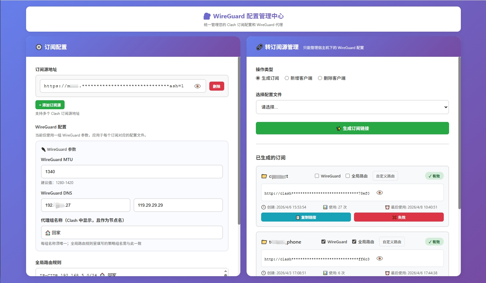

# WireGuard Config Merger

> 目前仅支持霉霉 Clash 转订阅，其他订阅源正在适配中。

将远程 Clash 订阅与本地 WireGuard 客户端配置合并，提供 Web 管理能力（登录认证、配置管理、客户端新增/删除、订阅链接生成）。



## 功能特性

- 合并远程 Clash 订阅（支持多个订阅源）
- 将 `conf/` 下 WireGuard `.conf` 自动转换为 Clash `wireguard` 节点
- Web 登录保护 + Token 订阅管理
- 通过宿主机脚本新增/删除 WireGuard 客户端
- 提供健康检查与配置管理 API

## 目录结构（必要）

```text
.
├─ conf/      # WireGuard 客户端配置（*.conf）
├─ data/      # 应用配置与 token 持久化
└─ script/    # add-client.sh / delete-client.sh / peers.list
```

## 快速开始

### 方式一：`docker run`（推荐 Linux 宿主机）

```bash
docker run -d \
  --name clashandwireguard-config-merger \
  --network=host \
  --cap-add=NET_ADMIN \
  -e PORT=12333 \
  -e WEB_USERNAME=admin \
  -e WEB_PASSWORD=admin123 \
  -e WG_INTERFACE=WG \
  -e WG_SERVER=your.domain.com:51820 \
  -v /etc/wireguard/conf:/app/conf \
  -v /mnt/docker_lib/data:/app/data \
  -v /etc/wireguard/script:/app/script \
  --restart always \
  toretto5060/clashandwireguard-config-merger:latest
```

访问：`http://localhost:12333`

### 方式二：`docker-compose`

```bash
docker-compose up -d
```

## 必要环境变量

- `WEB_USERNAME`：Web 登录用户名（建议修改默认值）
- `WEB_PASSWORD`：Web 登录密码（建议使用强密码）
- `WG_SERVER`：写入客户端 `[Peer] Endpoint`，例如 `vpn.example.com:51820`

## 常用可选环境变量

- `PORT`：Web 服务端口，默认 `3000`
- `WG_INTERFACE`：宿主机 WireGuard 接口名，默认 `WG`（也可使用 `wg0`）
- `WG_PUBLIC_KEY`：桥接网络下容器无法 `wg show` 时建议手动设置
- `WG_SAVE_CONFIG`：是否自动写回 WireGuard 配置（按项目实际需要启用）

## 使用流程（最简）

1. 将 WireGuard 客户端配置放入 `conf/`（文件名例如 `client-a.conf`）
2. 启动容器并访问 Web 界面
3. 登录后在页面中保存远程订阅参数
4. 使用页面功能新增/删除客户端，或生成订阅链接
5. 在 Clash 客户端导入生成的订阅地址

## API 概览

- `GET /`：Web 管理界面
- `GET /config/:configName/:token`：获取合并后的订阅配置
- `GET /health`：健康检查
- `GET/POST /api/config`：读取/保存配置
- `POST /api/tokens` / `GET /api/tokens` / `DELETE /api/tokens/:token`：Token 管理
- `POST /reload`：重新加载配置

## 常见问题

### 1) 页面无法登录

- 检查 `WEB_USERNAME`、`WEB_PASSWORD` 是否正确传入
- 若开启反向代理，请确认未篡改 `Authorization` 或 Cookie

### 2) 订阅拉取失败

- 检查远程订阅 URL 是否可访问
- 检查容器网络连通性与 DNS
- 查看容器日志定位解析或超时错误

### 3) WireGuard 节点未出现在结果中

- 确认 `conf/` 已正确挂载到 `/app/conf`
- 确认 `.conf` 文件格式合法且包含必要字段（私钥、地址、对端）
- 检查容器日志中的解析报错

## 开发与调试

```bash
# 安装依赖
npm install

# 本地开发启动
npm run dev

# 生产模式启动
npm start
```

## 文档与说明

- 完整文档：`README.full.md`
- UI 预览图：`assets/ui-preview.png`

## 许可证

MIT（如仓库内 LICENSE 另有说明，以仓库文件为准）

## 贡献

欢迎提交 Issue / PR 来改进功能与文档。
